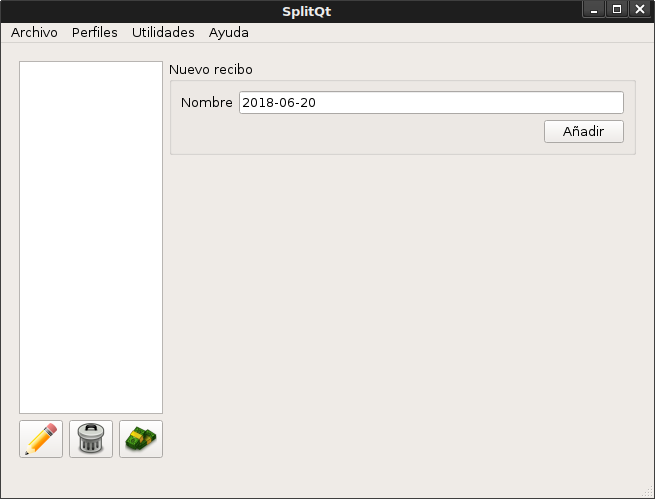
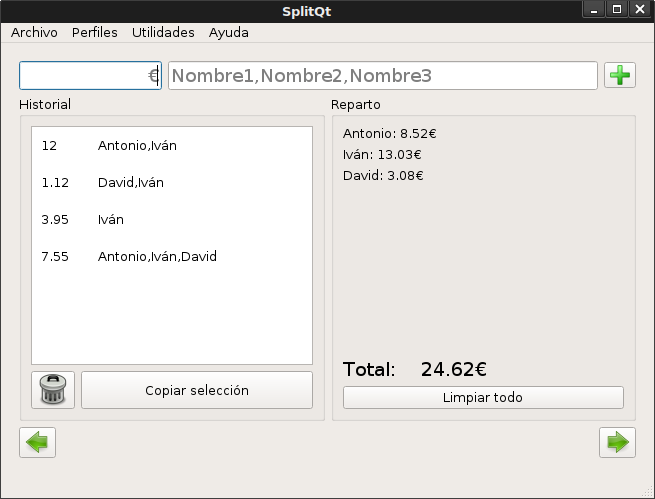

**SplitQt** es una aplicación de escritorio desarrollada en C++ con el [framework Qt](https://es.wikipedia.org/wiki/Qt_(biblioteca)). El programa ayuda a realizar el **reparto del coste de recibos** (compra, luz, agua) de quienes comparten gastos.

SplitQt permite gestionar, guardar y cargar de manera sencilla varios recibos para calcular cuánto tendría que abonar cada persona.

